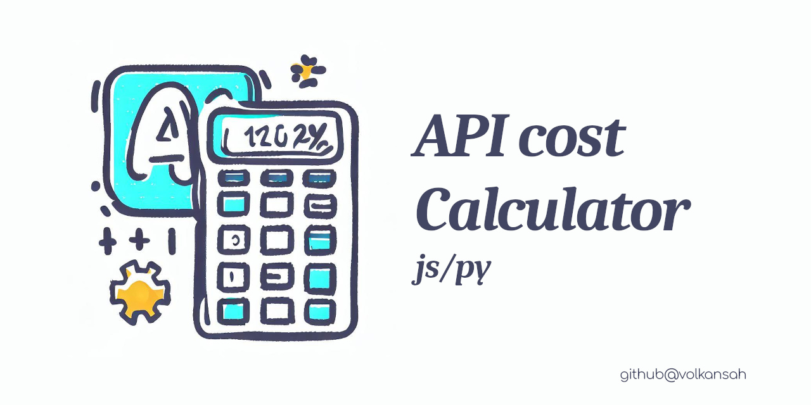

# OpenAI Cost Calculator

###### (update prices/modules 06/2024)

OpenAI Cost Calculator is a simple tool for your projects that allows you to estimate the cost of using OpenAI's GPT-3 API. It includes implementations in both JavaScript and Python. 

The main scripts are `ccp.py` (Python version) and `ccj.js` (JavaScript version), which you can use to calculate the cost of your API usage.

## Requirements

- Node.js and npm (for the JavaScript version)
- Python 3.x (for the Python version)

## Usage
### JavaScript

1. Navigate to the `in-javascript` directory.
2. Install the dependencies with `npm install`.
3. Run the script with the desired model name and the number of calls. For example:

```shell
node ccj.js chatgpt-4k 1000
```
### Python
1. Navigate to the `in-python` directory.
2. No extra dependencies are needed. Just ensure you're running Python 3.x.
3. Run the script with the desired model name and the number of calls. For example:
```shell
python3 ccp.py chatgpt-4k 1000
```
## Price Configuration and Tokens
The pricing information for each model is stored in a prices.json file in each directory. It's essential to note that prices can vary, and you should make sure to keep the prices updated according to OpenAI's official pricing.

One crucial part of understanding the pricing is knowing how OpenAI counts tokens. A "token" in OpenAI terms can be as short as one character or as long as one word. For instance, "ChatGPT is great!" is encoded into six tokens: ["Chat", "G", "PT", " is", " great", "!"]. In most languages, a single character like "a" or a punctuation mark like "." is considered one token.

## Please Note
This tool is meant to give a rough estimate of how much your usage of the GPT-3 API might cost. However, it's always a good idea to monitor your actual usage through the OpenAI API dashboard to prevent unexpected costs. This tool does not guarantee the exact pricing, as prices may vary, and the token count may differ based on the specifics of your API calls.

## Contributing
Contributions are welcome! Please feel free to submit a pull request.

## Thank you for your support!
If you appreciate my work, please consider supporting me:

- Become a Sponsor: [Link to my sponsorship page](https://github.com/sponsors/volkansah)
- :star: my projects: Starring projects on GitHub helps increase their visibility and can help others find my work.
- Follow me: Stay updated with my latest projects and releases.
- 
## License
This project is licensed under the "Help the World Grow [💔](https://jugendamt-deutschland.de) " License . See the [LICENSE](LICENSE) for more infos!

## Copyright
[Volkan 'sah' Kücükbudak](https://github.com/volkansah)
